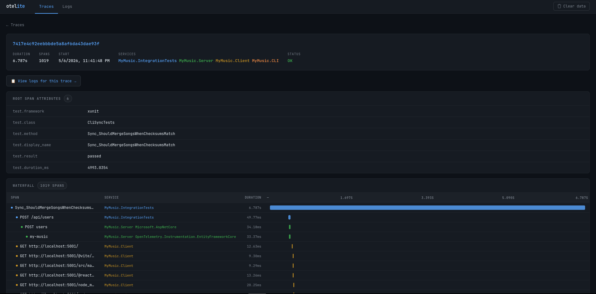
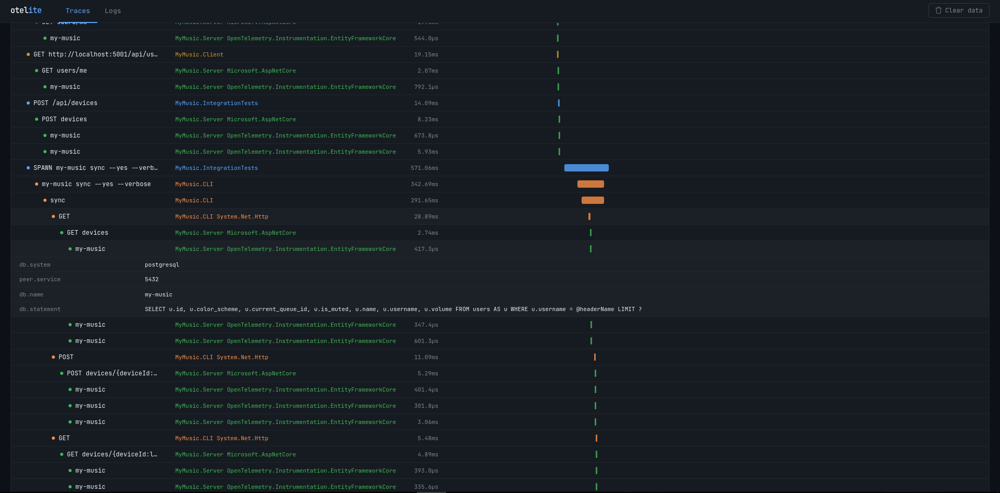
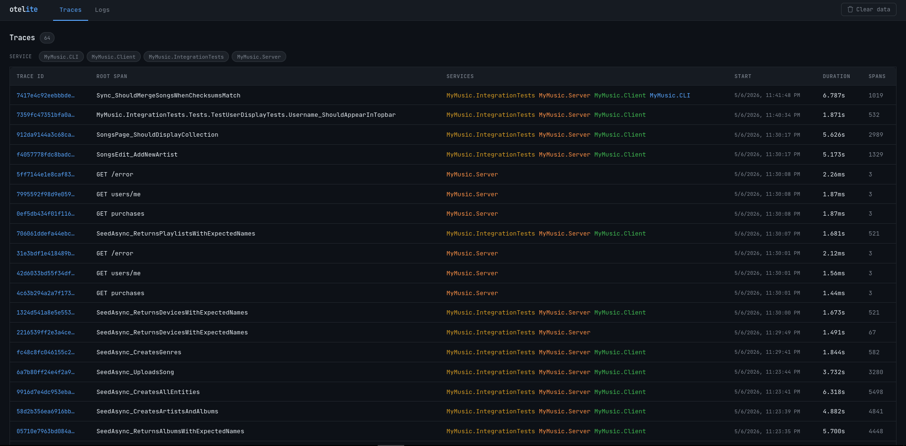
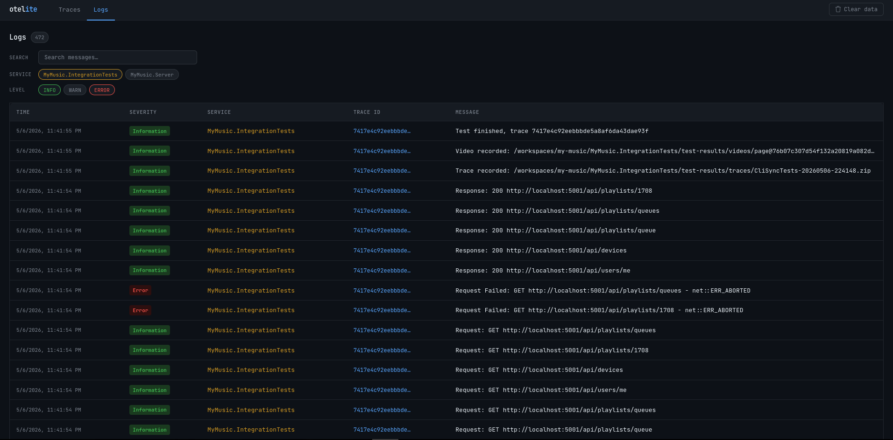

# otelite

A lightweight OpenTelemetry collector that stores traces and logs in SQLite. Designed for local development and debugging - no complex infrastructure required.

> **NOTE** This is a vibe-coded fork of the lovingly tiny **otelite** project, adding some small quality of life improvements on the server, and a beautiful and simple Web UI for viewing traces & logs.

## Features

- Receives OTLP traces and logs over HTTP
- Stores data in SQLite for easy querying
- Supports both JSON and Protobuf encodings
- Single binary with no external dependencies
- Built-in CLI for querying stored data
- Simple web UI for browsing traces and logs
- Endpoint to clear the database without restarting the app

## Screenshots

| | |
|---|---|
|  |  |
|  |  |

## Build

Requires Go 1.24+

```bash
make build
```

Or directly:

```bash
go build -o otelite main.go
```

## Usage

### Start the collector

```bash
./otelite server -port 4318 -db otel.db
```

Configure your application to send OTLP data to `http://localhost:4318`.

### Query stored data

```bash
# List recent traces
./otelite query -db otel.db "SELECT service_name, span_name, trace_id FROM traces ORDER BY id DESC LIMIT 10"

# Find traces by service
./otelite query -db otel.db "SELECT * FROM traces WHERE service_name = 'my-service'"

# View logs
./otelite query -db otel.db "SELECT service_name, severity_text, body FROM logs ORDER BY id DESC LIMIT 20"
```

### Makefile shortcuts

```bash
make start   # Start server in background
make stop    # Stop background server
make clean   # Remove database and binary
```

## HTTP Endpoints

| Endpoint | Method | Description |
|----------|--------|-------------|
| `/v1/traces` | POST | Receive OTLP trace data |
| `/v1/logs` | POST | Receive OTLP log data |
| `/traces` | GET | Query stored traces (JSON) |

## OTLP Compatibility

### Supported

- HTTP transport (port 4318)
- Binary Protobuf encoding (`application/x-protobuf`)
- JSON Protobuf encoding (`application/json`)
- Traces signal
- Logs signal

### Not Supported

- gRPC transport (port 4317)
- Metrics signal
- Profiles signal
- Compression (gzip)
- Authentication
- Retry-After / backpressure headers

## Database Schema

**traces table**: id, timestamp, trace_id, span_id, parent_span_id, service_name, span_name, kind, start_time, end_time, status_code, raw_json

**logs table**: id, timestamp, trace_id, span_id, service_name, severity_number, severity_text, body, log_timestamp, raw_json

## License

[Apache License 2.0](LICENSE)
